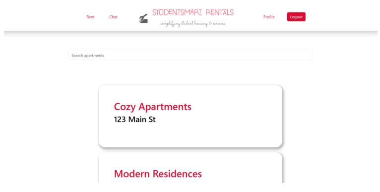
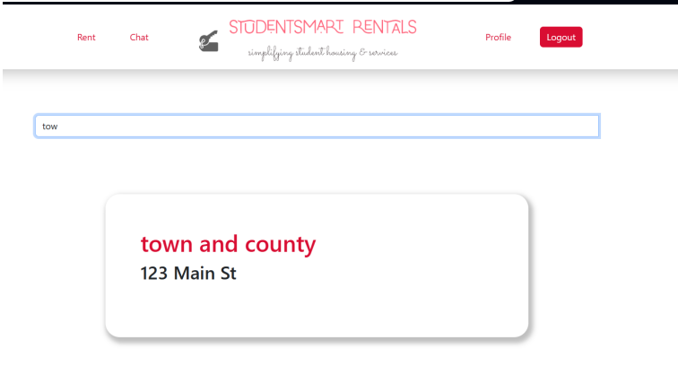
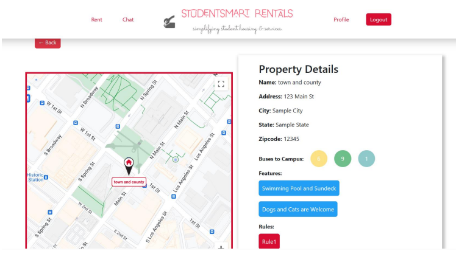
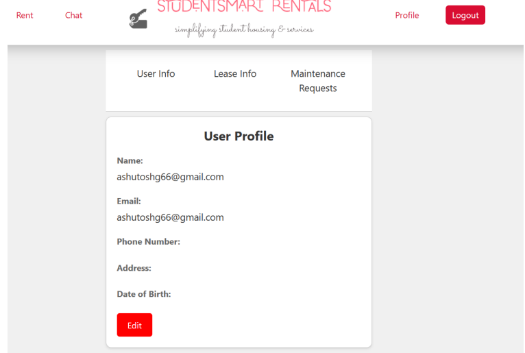
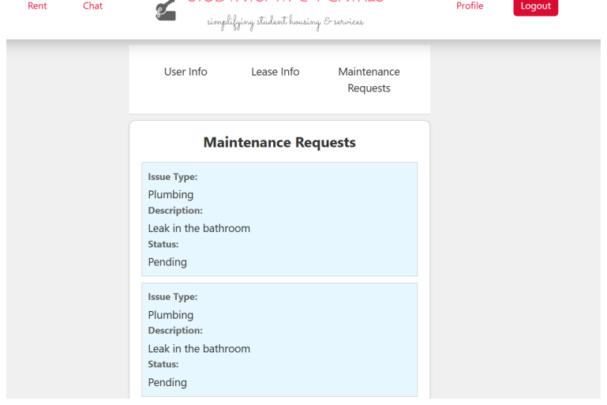
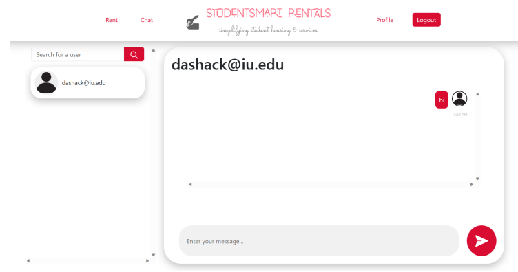

# StudentSmartRentals

# Product Overview

- The Rental & Services Management System project, driven by the founder's experiences, aims to make the moving-in process easier for local and international students.
- It addresses gaps in the rental platform market, focusing on apartment rentals and related services tailored for students at Indiana University of Bloomington. 
- The system features extensive property listings, including details like proximity to essential amenities, thus centralizing information and reducing the need to visit multiple platforms.
- It also offers tools such as multimedia content, map views, and user reviews to aid in decision-making, and simplifies the access to services like transportation and utilities setup.
- By integrating messaging and chat, it creates a community space that enhances the experience for international students during a pivotal life transition.

# System Requirements

- **Operating Environment**: The system is designed for web environments and should perform seamlessly across various devices and platforms.
- **Responsive Web Application**: Built as a web application using React, with backend technologies in line with the MERN stack.
- **Database**: Utilizes MongoDB for storing apartment listings, user profiles, and transactions.
- **Authentication and Security**: Incorporates Firebase for secure user authentication, including MFA.
- **Client-Side (Frontend)**: The frontend is developed with React for user interaction.
- **Server-Side (Backend)**: Managed by Node.js and Express.js, it handles requests and manages authentication through Firebase.

# Product Installation

- **Initial Setup**: As a web-based application, no traditional installation is necessary. It is accessed via a web browser.
- **Dependencies**: A current browser version is required to support the application's web technologies.
- **Software Support Packages**: Backend modifications require knowledge of the MERN stack, with potential server-side installations of Node.js, MongoDB, etc.
- **Python Dependency**: If Python is needed, installation instructions can be found on the official Python website.

# Product Operation

1. **Public Interface and User Registration**:
   - Offers a public interface for displaying available rentals.
   - Features a secure registration and login system with password management and encryption standards.
    
2. **Apartment Listing and Search Functionality**:
   - Detailed apartment listings are available with a robust search feature managed by the SearchService class.
    
3. **Maps and Location Services**:
   - Integrates mapping services to display property locations and proximity details.
    
4. **User Profile Management**:
   - Allows users to manage personal information, lease details, and maintenance requests.
    
5. **Maintenance Requests and Insurance Information**:
   - Users can submit maintenance requests and access rental insurance information.
    
6. **User Interface and Accessibility**:
   - Adheres to design principles for a consistent and accessible experience, focusing on data security and user-friendly navigation.
7. **User Chat**:
   - Provides a search function for finding users to chat with, and a chat box for real-time messaging and interaction.
    
